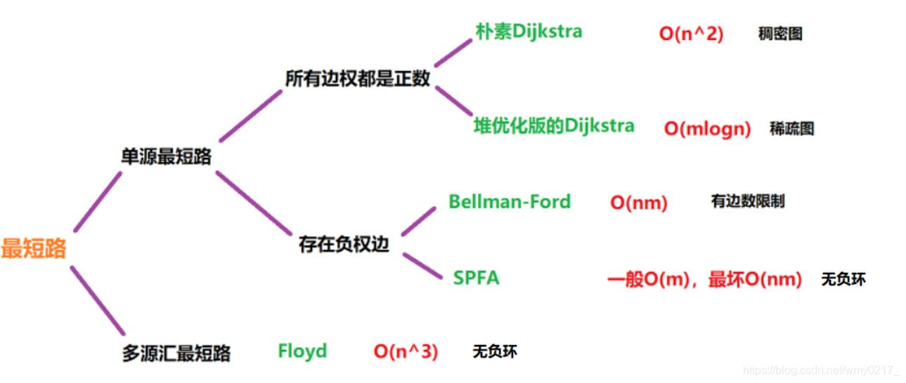

# wxx_note

# Aboat major

## multivalued dependencies

* 多值依赖的意义
* 多值依赖与函数依赖的区别
* 多值依赖的定义
* 多值依赖性质的证明(使用 temple 证明)

  传递性

  函数依赖可以看作是多值依赖的特殊情况

  并规则

  分解规则

### **传递性**

 若 X→→Y，Y→→Z，则 X→→Z-Y。

证明该性质时，其存在两种特殊情况：

① 在 X∩[Y∪Z]=Ø 时，设存在 U 的子集 X，Y，Z，K(X,Y,Z,K∈U)，其中 K=U-X-Y-Z。存在元组 S，T 属于关系 r(S,T∈r)且 S[X]=T[X],并将 YZ 元组分解 Y= (Y-Z)∪(Y∩Z)，Z= (Z-Y)∪(Y∩Z)，则有如表 1.3.3 下列元组

||X|Y-Z|Y∩Z|Z-Y|K|
| -| ----| ------| -------| ------| ----|
|S|S[X]|S[Y-Z]|S[Y∩Z]|S[Z-Y]|S[K]|
|T|T[X]|T[Y-Z]|T[Y∩Z]|T[Z-Y]|T[K]|

表 1.3.3

由 X→→Y 可得，w，v 元组属于关系 r(W,V∈r)，则如表 1.3.4 下列元组

||X|Y-Z|Y∩Z|Z-Y|K|
| -| ----| ------| -------| ------| ----|
|W|W[X]|S[Y-Z]|S[Y∩Z]|T[Z-Y]|T[K]|
|V|V[X]|T[Y-Z]|T[Y∩Z]|S[Z-Y]|S[K]|

表 1.3.4

其中 W[X]=V[X]=S[X]=T[X]。将现有 S,T,W,V 作为已知条件进行变换。

若需要求得 X→→Z-Y 成立，则根据多值依赖的元组定义则需要证明以下元组 W'，V'满足 W'，V'属于关系 r(W',V'∈r)，即如表 1.3.5 下列元组

||X|Y-Z|Y∩Z|Z-Y|K|
| --| ----| ------| -------| ------| ----|
|W'|S[X]|T[Y-Z]|T[Y∩Z]|S[Z-Y]|T[K]|
|V'|T[X]|S[Y-Z]|S[Y∩Z]|T[Z-Y]|S[K]|

表 1.3.5

现对 S，W 元组由 Y→→Z 可得 W~1 ​~​~~,V~~​~1~ 元组，其中 Y= (Y-Z)∪(Y∩Z)，则有如表 1.3.6 下列元组

||X|Y-Z|Y∩Z|Z-Y|K|
| -| ----| ------| -------| ------| ----|
|W~1~|S[X]|S[Y-Z]|S[Y∩Z]|S[Z-Y]|T[K]|
|V~1~|S[X]|S[Y-Z]|S[Y∩Z]|T[Z-Y]|S[K]|

表 1.3.6

同理，对 T，V 元组由 Y→→Z 可得 W~2 ​~​~~,V~~​~2~ 元组，其中 Y= (Y-Z)∪(Y∩Z) ，则有如表 1.3.7 下列元组

||X|Y-Z|Y∩Z|Z-Y|K|
| -| ----| ------| -------| ------| ----|
|W~2~|T[X]|T[Y-Z]|T[Y∩Z]|T[Z-Y]|S[K]|
|V~2~|T[X]|T[Y-Z]|T[Y∩Z]|S[Z-Y]|T[K]|

表 1.3.7

又有 S[X]= T[X]，则可知 W'=V~2~，V'=V~1~，即 X→→Z-Y。

②.在一般情况下，需要考虑元组 X 与元组 Y∪Z 的关系。设存在 U 的子集 X，Y，Z，K(X,Y,Z,K∈U)，其中 K=U-X-Y-Z，存在元组 S，T 属于关系 r(S,T∈r)且 S[X]=T[X]。现将 Y∪Z 分解：Y∪Z= [Y-Z]∪[Y∩Z]∪[Z-Y]，则需将元组 X 分解：X=X~0~∪X~1~∪X~2~∪X~3~，其中 X~1~=X∩(Y-Z),X~2~=X∩[Y∩Z],X~3~=X∩[Z-Y],X~0~=X-X~1~-X~2~-X~3~，即 X~0~，X~1~，X~2~，X~3~ 两两互不相交。则有如表 1.3.8 下列元组

||X~0~|X~1~|X~2~|X~3~|Y-Z-X~1~|Y∩Z-X~2~|Z-Y-X~3­~|K|
| -| ----| ----| ----| ----| --------| ---------| --------| ----|
|S|S[X~0~]|S[X~1~]|S[X~2~]|S[X~3~]|S[Y-Z-X~1~]|S[Y∩Z-X~2~]|S[Z-Y-X~3­~]|S[K]|
|T|T[X~0~]|T[X~1~]|T[X~2~]|T[X~3~]|T[Y-Z-X~1~]|T[Y∩Z-X~2~]|T[Z-Y-X~3­~]|T[K]|

表 1.3.8

其中有 X→→Y 元组定义可得 S[X~i~] =T[X~i~] (i=1,2,3)，和新元组 W，V。则有如表 1.3.9 下列元组

||X~0~|X~1~|X~2~|X~3~|Y-Z-X~1~|Y∩Z-X~2~|Z-Y-X~3­~|K|
| -| ----| ----| ----| ----| --------| ---------| --------| ----|
|W|W[X~0~]|S[X~1~]|W[X~2~]|W[X~3~]|W[Y-Z-X~1~]|W[Y∩Z-X~2~]|W[Z-Y-X~3­~]|W[K]|
|V|V[X~0~]|V[X~1~]|V[X~2~]|T[X~3~]|V[Y-Z-X~1~]|V[Y∩Z-X~2~]|V[Z-Y-X~3­~]|V[K]|

表 1.3.9

通过对比特殊情况与一般情况，则可发现在 Y→→Z 运用的过程中发生交换的元组分别为 Y-Z-X~1~, Y∩Z-X~2~, Z-Y-X~3~, K。即在一般情况下，通过 Y→→Z，(S,W)，(T,V)得到的新元组(W~1~,V~1~)，(W~2~,V~2~)其中(V~2~, V~1~)与所需要得到的 X→→Z-Y 的元组(W',V')相同。

即在一般情况下，若 X→→Y，Y→→Z，则 X→→Z-Y 成立。

[王壮_multivalued dependencies_whpu.pdf](/assets/王壮_multivalued dependencies_whpu-20231013121646-6kctkqh.pdf)

## Intelligent algorithms

[王壮_Intelligent algorithms_whpu.pdf](assets/王壮_Intelligent algorithms_whpu-20231013121739-h3ngilg.pdf)

# Aboat algorithm

‍

## 动态规划

### 01 背包

```cpp
#二维数组版
const int w[1024],c[1024]
int n,m;
cin>>n>>m;
for(int i=1;i<=n;i++) cin>>w[i]>>c[i];
for(int i=1;j<=n;j++)//i是物品个数
	for(int j=1;j<=m;j++)//j是背包空间
		if(j<w[i]) dp[i][j]=dp[i-1][j];
		eles dp[i][j]=max(dp[i-1][j],dp[i][j-w[i]]+c[i])
cout<<dp[n][m];
#一维数组版
int n,m;cin>>n>>m;
for(int i=1;i<=n;i++){
	int v,m;cin>>v>>m;
	for(int j=m;j>=v;j--) dp[j]=max(dp[j-1],dp[j-v]+m);
}//从m最大值开始遍历且最小值大于物品体积是为保证能够加入物品
cout<<dp[m];
```

* 逐渐添加元素入背包，然后求在每个容量下的最大值(利用动态转移)
* 在逐渐增加背包容量下，当容量小于添加元素的体积时，该状态下的最大值 v1 与该容量下未添加元素时的最大值 v2 相同，而在大于添加元素的体积时，该状态需判断添加新元素与剩余空间所对应的值之和 v3 与未添加时的值 v1 的大小，取最大值

[带你学透 0-1 背包问题！| 关于背包问题，你不清楚的地方，这里都讲了！| 动态规划经典问题 | 数据结构与算法_哔哩哔哩_bilibili](https://www.bilibili.com/video/BV1cg411g7Y6/)

### 完全背包

* 最直接版完全背包

  ```cpp
  int n,m; cin>>n>>m;
  for(int i=1;i<=n;i++) cin>>w[i]>>c[i];
  for(int i=1;i<=n;i++)
  	for(int j=1;j<m;j++)
  		for(int k=0;k<j/w[i];k++)
  			dp[j]=max(dp[j],dp[j-k*w[i]]+k*c[i]);
  cout<<dp[m];
  ```

* ​​优化版二维完全背包​

  在完全背包问题中，物品可多项选择，及可以竖向转移—在未添加新物品时该容量下的值(01 背包问题原理)，和竖向转移—在添加新物品的情况加进行动态规划(及在 j-W[i]的背包大小所对应的值加上 C[i]值)，然后取最大值。

  ```cpp
  int n,m; cin>>n>>m;
  for(int i=1;i<=n;i++) cin>>w[i]>>c[i];
  for(int i=1;i<=n;i++)
  	for(int j=1;j<m;j++){
  		dp[i][j]=dp[i-1][j];//竖向转移
  		if(j-w[i]>=0)	dp[i][j]=max(dp[i][j],dp[i][j-w[i]]+c[i]);//横向转移
  }
  cout<<dp[n][m];
  ```

* 最简版完全背包问题

  ```cpp
  int n,m; cin>>n>>m;
  for(int i=1;i<=n;i++) cin>>w[i]>>c[i];
  for(int i=1;i<=n;i++)
  	for(int j=w[i];j<=m;j++){
  		dp[j]=max(dp[j],dp[j-w[i]]+c[i]);
  cout<<dp[m];
  ```

[背包九讲系列 1——01 背包、完全背包、多重背包 - 简书 (jianshu.com)](https://www.jianshu.com/p/0b9018bbacd7)

## 贪心算法

贪心算法，又名贪婪法，是寻找**最优解问题**的常用方法，这种方法模式一般将求解过程分成**若干个步骤**，但每个步骤都应用贪心原则，选取当前状态下**最好/最优的选择**（局部最有利的选择），并以此希望最后堆叠出的结果也是最好/最优的解。

**贪婪法的基本步骤：**

步骤 1：从某个初始解出发；
步骤 2：采用迭代的过程，当可以向目标前进一步时，就根据局部最优策略，得到一部分解，缩小问题规模；
步骤 3：将所有解综合起来。

### 最短路

​​

[最短路算法总结（超详细~）-CSDN 博客](https://blog.csdn.net/wmy0217_/article/details/105438163)

#### dijkstra

* 每次从未标记的节点中寻找距离出发点最近的节点，标记，收录到最优路径集合中
* 计算刚加入的节点 A 到相邻节点 B 的距离，不包括已标记的节点
* 若 `节点A到源点的距离`​ + `节点A到节点B的边长`​ < `节点B到源点的距离`​，更新节点 B 到源点的值
* 重复以上步骤，直到未标记的节点未空时，停止算法

[【算法】最短路径查找—Dijkstra 算法_哔哩哔哩_bilibili](https://www.bilibili.com/video/BV1zz4y1m7Nq?vd_source=bc4fa866e16a93e8322d340eefe71de3)

```c++
void dijkstra(int dist[], bool st[], int grid[][N])
{
    dist[x] = 0;
    for(int i = 1; i<=n; i++)
    {
        int t = -1;//标记最小权值点
        for(int j = 1; j<=n; j++)//寻找最小权值点
            if(st[j] == false && (t == -1 || dist[j] < dist[t]))
                t = j;
        st[t] = true;
        for(int j = 1; j<=n; j++)
            dist[j] = min(dist[j], dist[t] + grid[t][j]);
    }
}
```

#### bellman_ford

##### 优点

* 和 dijkstra 不同的是，BF 算法可以解决负环的最短路径问题，同时可以判断负环是否存在。
* 环：从某个顶点出发、经过若干个不同的顶点，可以回到该顶点的情况。
* 零环、正环、负环

##### 思路

1. 初始化源点 s 到各个点 v 的路径 `dis[v] = ∞，dis[s] = 0`​。
2. 进行 n - 1 次遍历，每次遍历对所有边进行松弛操作，满足则将权值更新。
   松弛操作：以 a 为起点，b 为终点，ab 边长度为 w 为例。dis[a]代表源点 s 到 a 点的路径长度，dis[b]代表源点 s 到 b 点的路径长度。如果满足下面的式子则将 `dis[b]` ​更新为 `dis[a] + w`​。

   * ​`dis[b] > dis[a] + w`​
3. 遍历都结束后，若再进行一次遍历，还能得到 s 到某些节点更短的路径的话，则说明存在负环路。

   理由在于：对于给定 n 个节点的图，从 i 到 j，最短路径至多有 n-1 条路径，当出现 n 条路径时，说明在该条路径上至少存在一个环，也就是如果在进行一次遍历，如果节点的最短路径还能得到更新，那么只有环存在时，才会更新路径

```cpp
struct edge{
	int v, w;//v是出边，w是当前点到出边v的权值
};

vector<edge> e[maxn];
int dis[maxn];
const int inf = 0x3f3f3f3f;

bool bellmanford(int s)
{
	memset(dis, 0x3f, sizeof(dis));
	dis[s] = 0;
	bool flag; // 判断一轮循环过程中是否发生松弛操作
	for (int i = 1; i <= n; i++)//至多遍历n-1次得到最短路径
	{
		flag = false;
		for (int u = 1; u <= n; u++)//依次遍历每一个点
		{
			if (dis[u] == inf)//当前点到源点还不存在路径时，不更新该点，理由如下
				continue;// 无穷大与常数加减仍然为无穷大，因此最短路长度为 inf 的点引出的边不可能发生松弛操作
			for (auto ed : e[u])//遍历当前点的所有邻边
			{
				int v = ed.v, w = ed.w;
				if (dis[v] > dis[u] + w)
				{
					dis[v] = dis[u] + w;
					flag = true;//存在松弛操作，打上标记
				}
			}
		}
		if (!flag)// 没有可以松弛的边时就停止算法
			break;
	}
	// 第 n 轮循环仍然可以松弛时说明 s 点可以抵达一个【负环】
	return flag;
}
```

#### folyd

设定矩阵 $A_{n*n}$，其中

$$
a_{ij}=\left\{
\begin{matrix}0,i=j
 \\c_{i,j}, (i,j)\in E
 \\ \infty , (i,j)\notin  E
\end{matrix}\right.
$$

**视频讲解：**​[最短路径（二）Floyd 算法_哔哩哔哩_bilibili](https://www.bilibili.com/video/BV1w54y1Q79E?spm_id_from=333.880.my_history.page.click&vd_source=bc4fa866e16a93e8322d340eefe71de3)

* 解决图中任意点到某一点之间的最短路问题，例如 P 点到 M 点，中间可以直达也可以经过其他点到达

在视频中拓展：

* $A_{n*n}$ 矩阵依据公式 $a_{ij} = min(a_{ij},a_{ik} + a_{kj})$ 迭代 n 次后得到 i 到 j 的最短路径，但是得不到经过那些点，可以用一个额外的数组来记录经过的点，在视频讲解的末尾位置
* $A_{n*n}$ 矩阵依据公式 $a_{ij} = min(a_{ij},max(a_{ik}, a_{kj}))$ 可以得到 i 到 j 的所有通路集合中的通路的最大边的的最小值，就是在这一堆通路中，每条通路都有一条最大的边，在将这些边中的最小值取出

```cpp
//针对无向图
void floyd(){
    //设k为中间节点，检查从i到j的距离和i到k，k到j（即以k作为中间节点绕行）的距离
	for(int k=0; k<n; k++){
        for(int i = 0; i<n; i++){
            for(int j = 0; j<n; j++){
                grid[i][j] = grid[j][i] = min(grid[i][j], grid[i][k] + grid[k][j]);
            }
        }
    }
}
```

### 最小生成树

#### prim

Prim （普里姆）算法是另一种常见并且好写的最小生成树算法。该算法的基本思想是从一个结点开始，不断加点（而不是 Kruskal 算法的加边）。具有贪心的思想。

具体来说，每次要选择距离集合（已访问点集合）最小的一个结点，以及用新的边更新其他结点的距离。

其实跟 Dijkstra 算法一样，每次找到距离最小的一个点，可以暴力找也可以用堆维护。

堆优化的方式类似 Dijkstra 的堆优化，但如果使用二叉堆等不支持 decrease-key 的堆，复杂度就不优于 Kruskal，常数也比 Kruskal 大。所以，一般情况下都使用 Kruskal 算法，在稠密图尤其是完全图上，暴力 Prim 的复杂度比 Kruskal 优，但 **不一定** 实际跑得更快。

时间复杂度：`O(n^2)`​

##### 流程

* 初始化：dist[N]为所有点到集合的距离，初始化为无穷大
* 任选一个点，然后将该点加入最短路集合
* 寻找距离到最短路集合最近的点，同时将该点加入最短路集合中
* 遍历该点的邻接点，更新邻接点到集合的距离 dist
* 重复三四步骤，n 次循环，即遍历 n 个点，得到最小生成树

##### 思路

在每一次选择一个点加入最小生成树集合中后，都会更新该点的所有邻接点到集合的距离，我们只要维护 dist 这个距离就可以得到答案，例如

第一次循环：在选取第一个点的时候，`t = 0，vis[0]==true`​，更新了该点的所有邻接点到 0 点的距离

第二次循环：选取了到 0 点最近的一个点，加入最小生成树集合，更新该点的所有邻接点到该点的距离

重复 n 次循环，也就是 n 个点，值得注意的是，我们每次选取的都是这个集合的所有邻接点，而这些邻接点都被更新过了，因此是可以得到答案的。

同时：还需要注意，如果在除开第一次选的点以外的点中，找到一个到集合距离无穷大的点，那么也就是说这个点是孤立点，一定是无法构成最小生成树的，即可返回 `impossible`​

```cpp
int grid[N][N], n, m;
int dist[N], vis[N];

int prim(){
    memset(dist, 0x3f, sizeof(dist));
    int sum = 0;
    for(int i = 0; i<n; i++){
        int t = -1;
        for(int j = 1; j<=n; j++){
            if(!vis[j] && (t == -1 || dist[t] > dist[j]))
                t = j;
        }
        vis[t] = true;
        //如果该点非第一个点，但是该点到集合的距离是无穷大，也就是说该点是孤立出来的
        if(i && dist[t] == INF)
            return INF;
          
        if(i)//该点非第一个点
            sum += dist[t];
      
        for(int j = 1; j<=n; j++)
            dist[j] = min(dist[j], grid[t][j]);
    }   
    return sum;
}
```

#### kruskal

Kruskal （克鲁斯克尔）算法是一种常见并且好写的最小生成树算法，由 Kruskal 发明。该算法的基本思想是从小到大加入边，是个贪心算法。

使用：并查集、图的存储、贪心

例题：[4291. 丛林之路 - AcWing 题库](https://www.acwing.com/problem/content/description/4294/)

时间复杂度：`O(mlogm)`​（m 是边数）

##### 流程

* 将所有边按权值从小到大排序，时间复杂度 `O(mlogm)`​
* 依次遍历所有边，如果某边的两点不构成回路，即加入最短路径集合
* 统计最短路径集合中的边个数，如果小于 n-1，即不构成最小生成树，等于 n-1，即可构成最小生成树

```cpp
struct edge{
    int a, b, w;//始点，终点，权
}edges[M];
int p[N], cnt;
void add(int a, int b, int w){
    edges[cnt].a = a, edges[cnt].b = b, edges[cnt].w = w, cnt++;
}

int find(int x){
	if(p[x] != x)
        p[x] = find(p[x]);
	return p[x];
}

int kruskal(){
    for(int i = 1; i<=n; i++) p[i] = i;
    sort(edges, edges + cnt);
    int sum = 0, en = 0;//权值和，路径条数
    for(int i = 0; i<cnt; i++){
		int a = edges[i].a, b = edges[i].b, w = edges[i].w;
        int pa = find(a), pb = find(b);
        if(pa != pb){
            p[pa] = pb;
            sum += w;
            en++;
        }
    }
    if(en < n - 1){
        cout << "无法构成最小生成树";
        return -1;
    }
    return sum;
}
```
